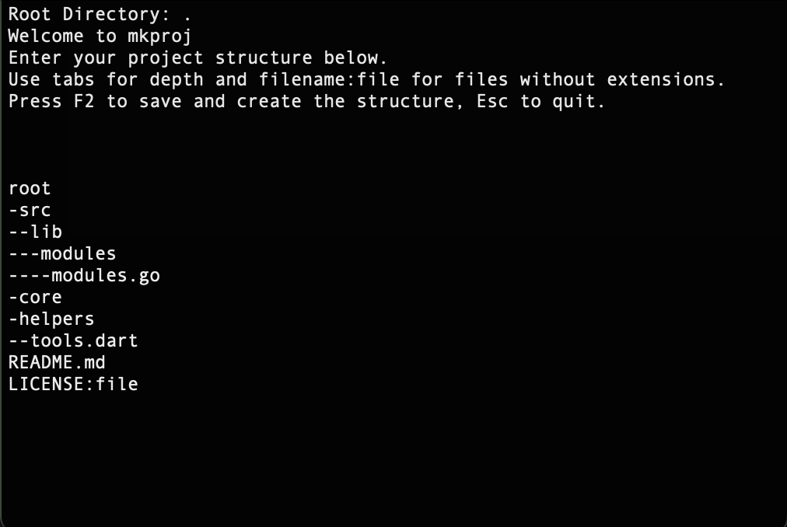
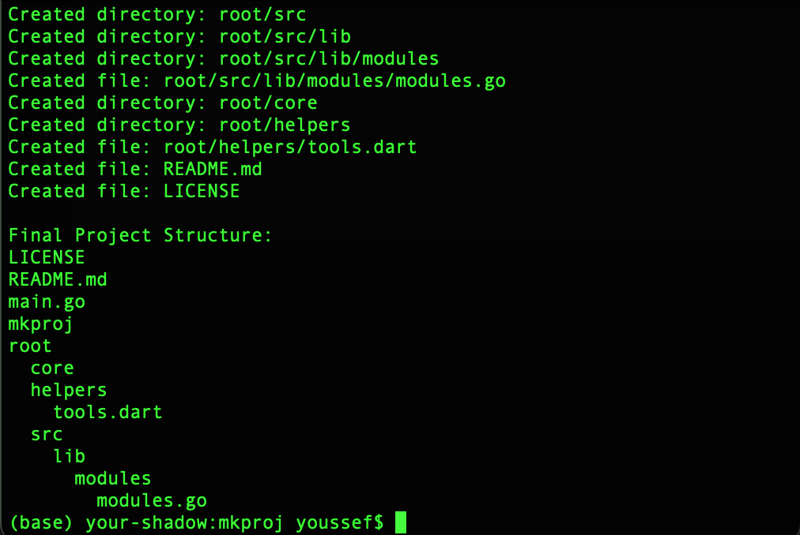

# mkproj: An Interactive CLI Tool to Setup Your Project Trees 🌳

`mkproj` is a simple and effective command-line interface (CLI) tool designed to help developers quickly create, visualize, and manage their project structures. With an intuitive interactive mode and flexible commands, `mkproj` provides a fast way to organize your project files and folders.

## Features


Interactive Mode             |  Interactive Mode output
:-------------------------:|:-------------------------:
  |  


- **Interactive Mode**: Easily create and modify your project structure interactively using standard editing keys. Build your ideal layout with minimal friction.
- **Text-Based Structure Creation**: Create a project structure from a text file or piped input.
- **Tree View**: Display the current directory structure, with the option to include or exclude hidden files.

## Installation

`mkproj` will be available on [Homebrew](https://brew.sh/) soon, allowing easy installation for macOS users.

For other platforms, you can download and build the binary from the [source code repository](https://github.com/jobehi/mkproj).

### Setup mkproj Globally on macOS (From Source Code)

To set up `mkproj` globally on macOS from the source code, follow these steps:

1. **Clone the Repository**:
   ```sh
   git clone https://github.com/jobehi/mkproj.git
   cd mkproj
   ```

2. **Build the Binary**:
   Build the `mkproj` binary using Go:
   ```sh
   go build -o mkproj
   ```

3. **Move the Binary to `/usr/local/bin`**:
   Move the compiled binary to `/usr/local/bin` to make it accessible globally:
   ```sh
   sudo mv mkproj /usr/local/bin/
   sudo chmod +x /usr/local/bin/mkproj
   ```

4. **Verify Installation**:
   You can now use `mkproj` from anywhere in your terminal:
   ```sh
   mkproj help
   ```


## Usage

### Command Overview

```sh
mkproj [command] [options]
```

- **create**: Create a project structure from a text file or piped input.
- **tree**: Display the current directory structure.
- **help**: Display this help message.

### Options

- `--root=<path>`: Specify the root directory for your project structure (default is the current directory).
- `--file=<path>`: Provide a file that contains the project structure (used with `create`).

### Interactive Mode

By default, `mkproj` starts in interactive mode, where you can manually build your project structure:

- Use standard editing keys to modify the structure.
- Press **F2** to save and create the structure.
- Press **Esc** to exit without saving.

### Examples

- **Start in Interactive Mode**:
  ```sh
  mkproj
  ```
  This launches `mkproj` in an interactive environment where you can create and edit your project structure on the fly.

- **Create a Project Structure from a Text File**:
  ```sh
  mkproj create --file=structure.txt --root=./new_project
  ```
  This command reads the project structure from `structure.txt` and creates it in the specified root directory.

- **Display the Current Directory Tree**:
  ```sh
  mkproj tree --root=./my_project
  ```
  Displays the directory structure of `./my_project` without showing hidden files.

- **Display the Directory Tree Including Hidden Files**:
  ```sh
  mkproj tree --root=./my_project --all
  ```
  Displays the directory tree of `./my_project`, including hidden files.

## Project Structure Input Format

The input structure can be created interactively or provided as a text file. You can use dashes (`-`) for depth and suffix `:file` to mark an entry as a file (for files with no extensions). For example:

```txt
project-root
- src
-- main.go
-- utils
--- helper.go
- README.md
- .gitignore:file
```

## Building from Source

To build `mkproj` from source, clone the repository and run:

```sh
git clone https://github.com/jobehi/mkproj.git
cd mkproj
go build -o mkproj
```

## Contributing

Contributions are welcome! Please open an issue or a pull request on the [GitHub repository](https://github.com/jobehi/mkproj) to report bugs or suggest improvements.
Refer to the [Contributing Guidelines](CONTRIBUTING.md) for more information.

## License

`mkproj` is released under the [MIT License](LICENSE).
